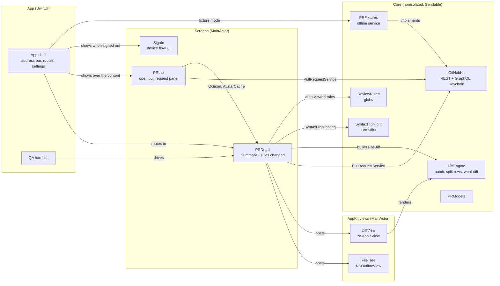
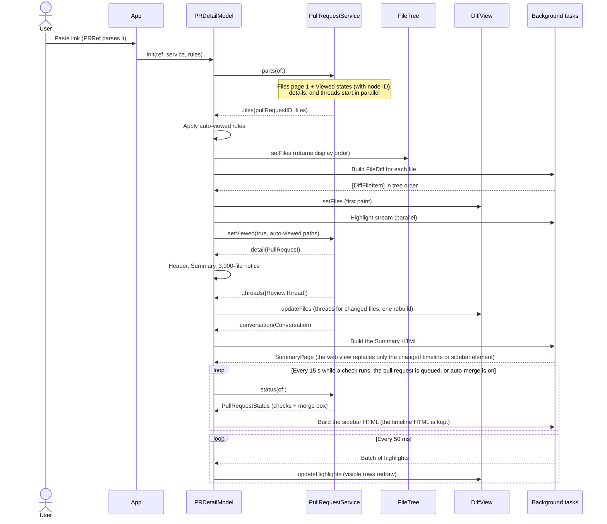
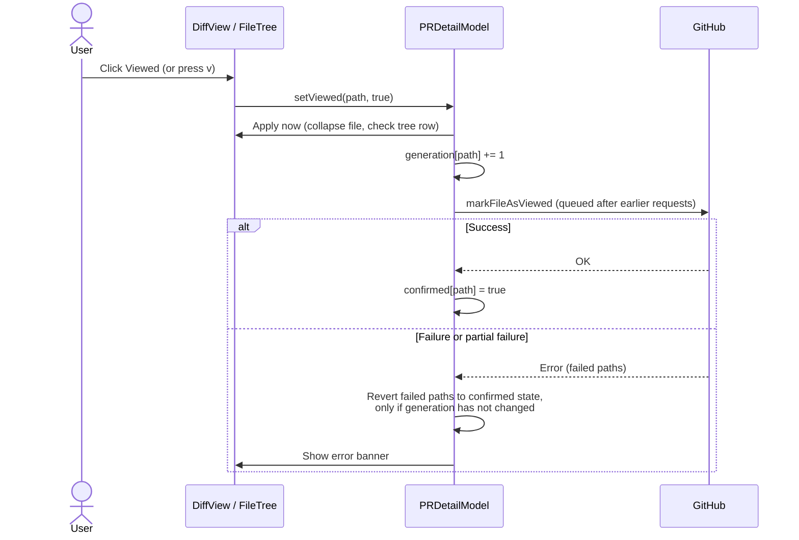
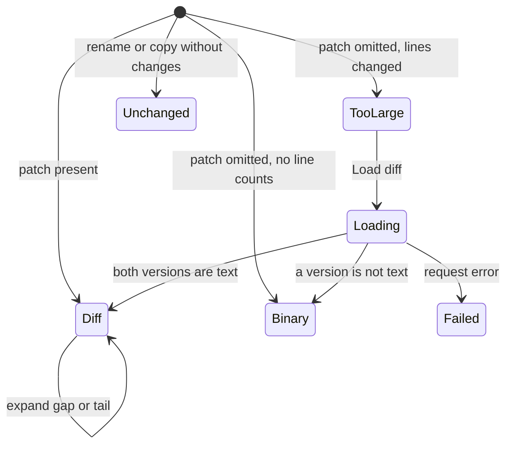

# Architecture

This document uses ASD-STE100 Simplified Technical English.

## Modules



- A module depends only on modules at its level or lower. `AGENTS.md` has the table.
- `PRDetail` talks to GitHub only through `PullRequestService`. `GitHubClient` and `FixturePullRequestService` implement
  it, so the harness and the tests use the same screen code as production.
- New screens (a pull request list, a repository picker) are new modules that `App` routes to.

## Open a pull request



- The diff shows when the files and Viewed states arrive. It does not wait for details, threads, the conversation, or
  highlighting.
- The Summary web view stays in the window after the details arrive, so a tab switch does not load it again.
- The diff waits for Viewed states, because they decide which files are collapsed. Without them, files would collapse
  after the first paint and move the content.
- A PR link on the clipboard starts a prefetch when the app becomes active. Opening that PR within 60 seconds uses the
  prefetch (`PrefetchedService`).

## Summary sidebar and pull request actions

The Summary page has two columns: the conversation and a 320 px sidebar. The sidebar stays at the top of the window while
the conversation scrolls (`position: sticky`). Below 960 px, the sidebar goes above the conversation and does not stick.

- The sidebar is one fragment (`<aside id="sidebar">`): the review card, the merge box (review decision, checks,
  mergeability, action row), and the "Convert to draft" link. `SummaryHTML.sidebar` builds it off the main actor from
  `SidebarContent`. The web view replaces only this element, so the scroll position and the Checks open state stay.
- `MergeBoxState` picks the action row from `MergeStatus`, in this order: merged, closed, draft, queued, auto-merge on, no
  write access, conflicts, merge queue, clean (split merge button), blocked with auto-merge (Enable auto-merge), blocked.
  Admins also get "Bypass rules and merge now" when the normal merge is not available.
- `SidebarState.actions` is the set of buttons that show. The model ignores a click on any other action.
- Clicks go to Swift through a `WKScriptMessageHandler` in the `summarySidebar` content world. The page world cannot
  post to it. The script accepts only trusted clicks on `[data-action]` buttons inside `body > .layout > aside#sidebar`.
  Swift accepts only `SidebarAction` names.
- The caret of the split button opens a native `NSMenu` below the caret. The chosen method stays for this pull request.
- Approve and Request changes open `ReviewSheet`. A merge opens `MergeSheet`, because GitHub cannot undo it. Enqueue,
  dequeue, and auto-merge changes run at once.
- Only one action runs at a time. While it runs, its button shows a spinner and a verb, and all buttons are disabled.
- Merge, enqueue, and auto-merge send `expectedHeadOid` = the head of the loaded diff (`pullRequest.headOid`). The merge
  sheet captures it when it opens. When a status refresh shows another head, the merge box shows "New commits were pushed.
  Reload to review them." with a Reload button. Merge actions and ⇧⌘↩ stay disabled until the reload. Review and draft
  actions stay enabled.
- A status that changes the state or the draft flag updates `pullRequest`, so the header badge changes. The Summary
  document does not reload. The header shows "Queued" while the pull request is in the merge queue.

```mermaid
sequenceDiagram
    actor User
    participant Page as Sidebar (web view)
    participant Model as PRDetailModel
    participant Service as PullRequestService

    User->>Page: Click "Squash and merge" (or press ⇧⌘↩)
    Page->>Model: handle(.merge) (message from the summarySidebar world)
    Model->>User: MergeSheet
    User->>Model: Confirm (⌘↩)
    Model->>Page: Spinner "Merging…", all buttons disabled
    Model->>Service: perform(.merge(method, headOid, title, body))
    alt Success
        Model->>Service: status(of:) (a review reloads conversation(of:) instead)
        Service-->>Model: Merged
        Model->>Page: New sidebar fragment; header badge shows Merged
    else GitHub refuses
        Service-->>Model: GitHubError.rejected(message)
        Model->>Page: Error banner; sidebar as before
    end
```

Status polling:

- Every 15 s while a check runs, the pull request is queued, or auto-merge is on.
- Every 3 s, at most 5 times in a row, while GitHub still computes mergeability (`mergeable == UNKNOWN`).
- No polling after the pull request is merged or closed. An action cancels a scheduled refresh and refreshes at once.
- A successful action and a new head reset the 5-refresh budget for unknown mergeability.
- When the refresh after a successful action fails, a banner shows "Done, but could not refresh from GitHub: …". The
  refresh then retries every 3 s, at most 3 times, also when nothing else polls.

## Keyboard shortcuts

- `AppShortcuts` defines every shortcut once (`Shortcut.all`). Menu items and `.onKeyPress` use `keyboardShortcut` and
  `keyEquivalent`; AppKit `keyDown` handlers call `Shortcut.matches(_:)`. The Shortcuts settings tab lists `Shortcut.all`.
- Add a shortcut to the catalog first. `ShortcutTests` fails when two menu shortcuts, or two shortcuts in one area, use
  the same keys.
- Menu commands that move keyboard focus call AppKit `makeFirstResponder`. A `@FocusState` write from a command did not
  move first responder away from the diff table.

## Open pull request panel

- The active repository is the repository of the open pull request. On Home, it is the repository of the most recent
  entry in Recent. With no active repository, the toolbar button and ⌘D / ⌘⇧D are disabled.
- ⌘D requests the Mine tab and ⌘⇧D the Others tab. A request for the tab that shows closes the panel; a request for the
  other tab switches to it (`PRListPanelState`).
- When the panel opens, both tabs load in parallel. `PRListModel` keeps each list per repository and tab, so a repository
  switch shows that repository's last list, or a loading state, at once. A load that finishes for an earlier repository
  writes only to that repository's entry.

## Viewed state



## File content states



Each transition installs new content and increments the file's content generation.

## Markdown preview

- `FilesChangedViewController` holds the preview as a collapsed inspector split item. `previewPath` is the file it shows.
- `PRDetailModel.loadPreview` gets the head file (the merge-base file for a removed file). `MarkdownHTML` renders it
  off the main actor with `swift-markdown` and the tree-sitter highlighter.
- Each block has its source lines (`data-start`, `data-end`). `MarkdownChanges` gives the added lines and the removal
  points from the file's `FileDiff`. Blocks that contain them get `data-add` or `data-del`.
- Page JavaScript is off and a Content Security Policy blocks scripts and frames, because the file comes from the pull
  request. Only the gutter script runs, in its own content world. It draws the bars and sends clicked lines to
  `DiffViewController.revealLines`.
- A link to a file at the same commit opens that file in the app when the pull request changes it.

## Invariants

- **Content generation.** Every content change of a file increments `generations[path]`. A highlight or expansion result
  for an older generation is dropped. This prevents wrong colors after an expansion changes line indexes.
- **One expansion at a time per file.** Expansions of one file run in order. Each finds its hunk by the hunk's first
  new-side line, not by index, because an earlier expansion can merge hunks.
- **Viewed requests run in order.** A failed request reverts only the paths that failed, and only if the user did not
  change them after the request. It reverts to the state GitHub last confirmed.
- **Tree order is diff order.** `FileTree.orderedFilePaths` gives the order: folders first, then files, sorted without
  case. `DiffItemFactory` sorts the diff to match, as GitHub does.
- **Scroll sync never opens a folder.** `FileTree.reveal` selects the closest visible folder when a collapsed folder hides
  the file. This keeps the collapse rules in effect.
- **Full diffs compare against the merge base,** not the base branch tip. GitHub pull request diffs use the merge base.
