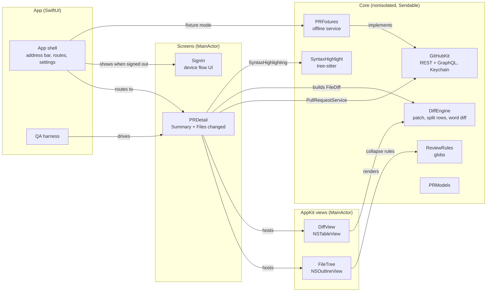
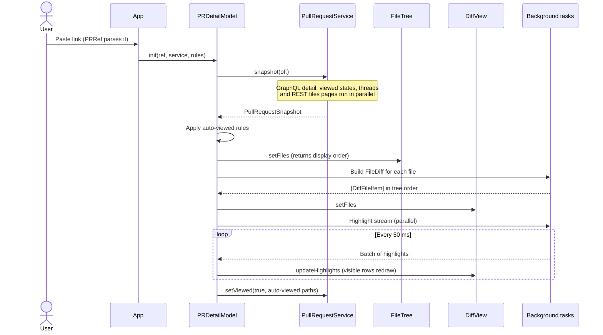
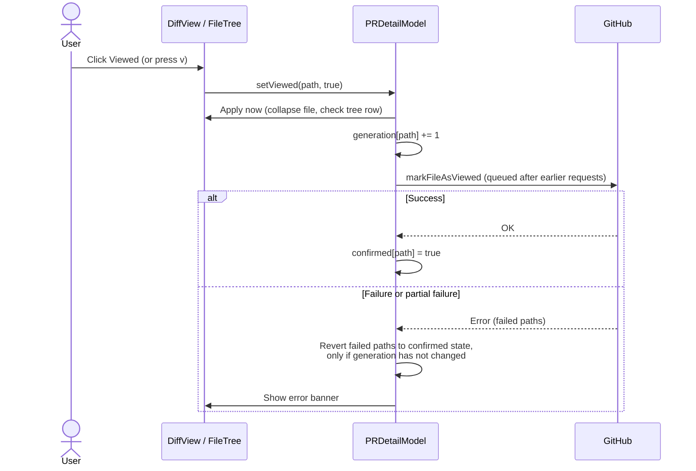
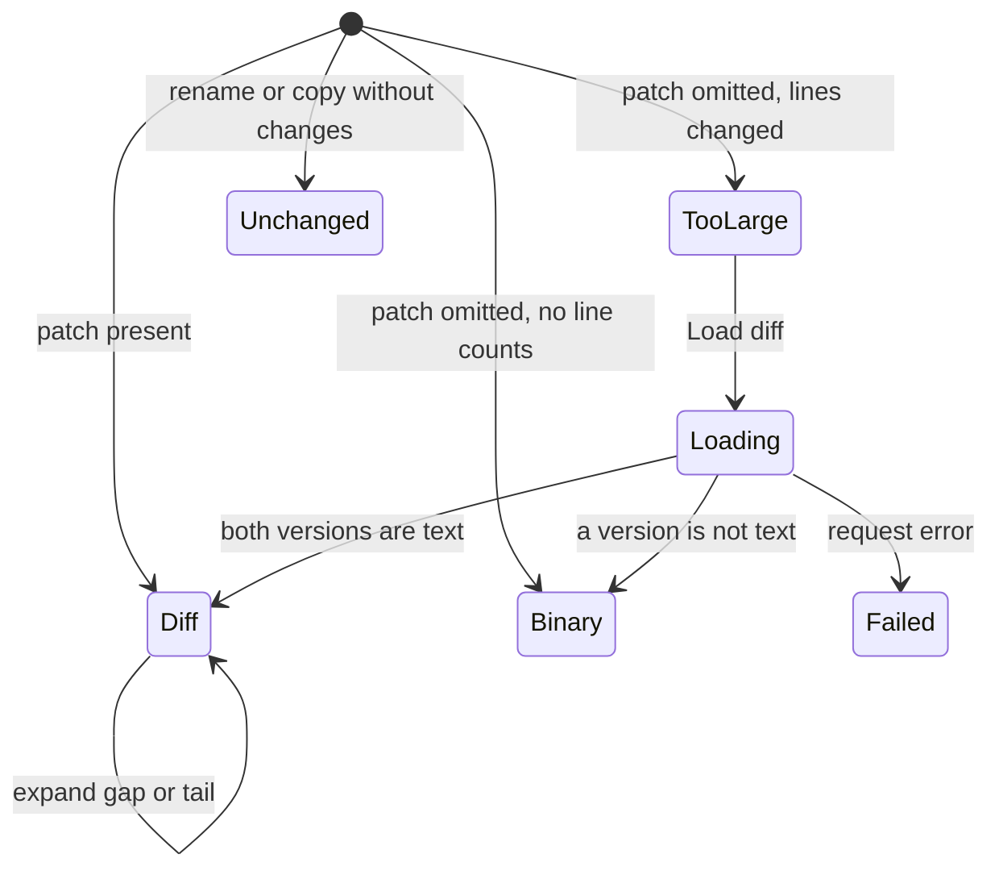

# Architecture

This document uses ASD-STE100 Simplified Technical English.

## Modules

- A module depends only on modules at its level or lower. `AGENTS.md` has the table.
- `PRDetail` talks to GitHub only through `PullRequestService`. `GitHubClient` and `FixturePullRequestService` implement
  it, so the harness and the tests use the same screen code as production.
- New screens (a pull request list, a repository picker) are new modules that `App` routes to.

## Open a pull request

The diff shows before highlighting finishes. Highlights recolor visible rows as batches arrive.

## Viewed state

## File content states

Each transition installs new content and increments the file's content generation.

## Invariants

- **Content generation.** Every content change of a file increments `generations[path]`. A highlight or expansion result
  for an older generation is dropped. This prevents wrong colors after an expansion changes line indexes.
- **One expansion at a time per file.** Expansions of one file run in order. Each finds its hunk by the hunk's first
  new-side line, not by index, because an earlier expansion can merge hunks.
- **Viewed requests run in order.** A failed request reverts only the paths that failed, and only if the user did not
  change them after the request. It reverts to the state GitHub last confirmed.
- **Tree order is diff order.** `FileTree.orderedFilePaths` gives the order: folders first, then files, sorted without
  case. `DiffItemFactory` sorts the diff to match, as GitHub does.
- **Scroll sync never opens a folder.** `FileTree.reveal` selects the closest visible folder when a collapsed folder hides
  the file. This keeps the collapse rules in effect.
- **Full diffs compare against the merge base,** not the base branch tip. GitHub pull request diffs use the merge base.
