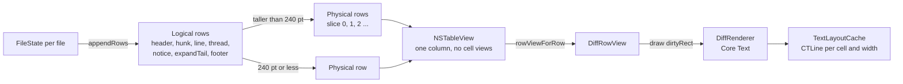

# Diff rendering and performance

This document uses ASD-STE100 Simplified Technical English.

The diff pane must scroll at the display refresh rate with 300 files and 20,000 changed lines. This document records the
design that meets that budget, and the measurements behind each decision.

## Row model

- One `NSTableView` holds every file. File headers are group rows, so `floatsGroupRows` gives sticky headers.
- The table has no cell views. `DiffRowView` draws the whole row with Core Text and Core Graphics. Only visible rows
  exist in memory.
- Row heights are computed once per width and stored in an array. `heightOfRow` is an array lookup.
- A line row is as tall as its longest wrapped side. Short ASCII lines skip Core Text measurement: their width is
  `length × character width`.

## Decisions and evidence

All numbers are from `scripts/perf.sh Fixtures/synthetic-300` (Release, 1600×1000 window, 16,190 rows).

| Decision | Problem it solves | Evidence |
| --- | --- | --- |
| Slice rows taller than 240 pt | A partial redraw of a tall row layer copies the whole backing store. A 1,360 pt comment thread is 35 MB at 2×. | Frames with a tall thread visible took 15–20 ms. After slicing they take under 8 ms. |
| `drawsAsynchronously` on row layers | Core Graphics fills and glyph blits ran on the main thread. | Max frame 115 ms → 50 ms. |
| Draw only the dirty rectangle | The table asks for 50 pt strips of a partly visible row. | Each strip draws only the text lines that intersect it. |
| Representable reports its size from the proposal | SwiftUI measured the AppKit subtree each time a row was added. | `NSHostingView.updateConstraints` left the per-frame profile. |
| Per-file row updates | Collapse, Viewed, and expansion rebuilt 16,000 rows. | Only the changed file's rows are measured, removed, and inserted. |
| Debounced width rebuild (80 ms) | Live resize re-measured every long line on each frame. | One rebuild after the resize settles. The caches clear at the same time. |
| No full-row background fill for code rows | Each pixel was filled twice. | Only the margins and each cell fill once. |

Current result: load 242 ms; median frame 2.4 ms; p95 7.9 ms; p99 12.5 ms (forced-display mode, which measures
main-thread work; see [qa-harness.md](qa-harness.md)).

## Text

- `TextLayoutCache` holds `CTLine` arrays per cell and width, with a limit of 6,000 cells. It clears on a theme or width
  change.
- Colors are resolved `CGColor` values per appearance (`DiffTheme.dark`, `DiffTheme.light`), because Core Text does not
  resolve dynamic `NSColor`.
- Wrapping uses `CTTypesetterSuggestLineBreak`. If a word break would leave only indentation on a line, the break falls
  inside the token instead.
- Tabs expand to 4 columns when the patch is parsed, so highlight ranges and word-diff ranges use the displayed text.

## Scroll position

A change to a file's rows keeps the view still:

- The anchor is captured before the change. For a code row it is the source line number, because an expansion changes
  hunk and row indexes.
- When the user marks a file as Viewed from its sticky header, the file collapses and its header moves to the top.

## Rules for changes to this module

- Measure with `scripts/perf.sh` before and after. Report p95, p99, and the hitch ratio.
- Do not add subviews to row views. Draw.
- Do not do work that grows with the pull request size on the main actor. Measure one file, not all files.
